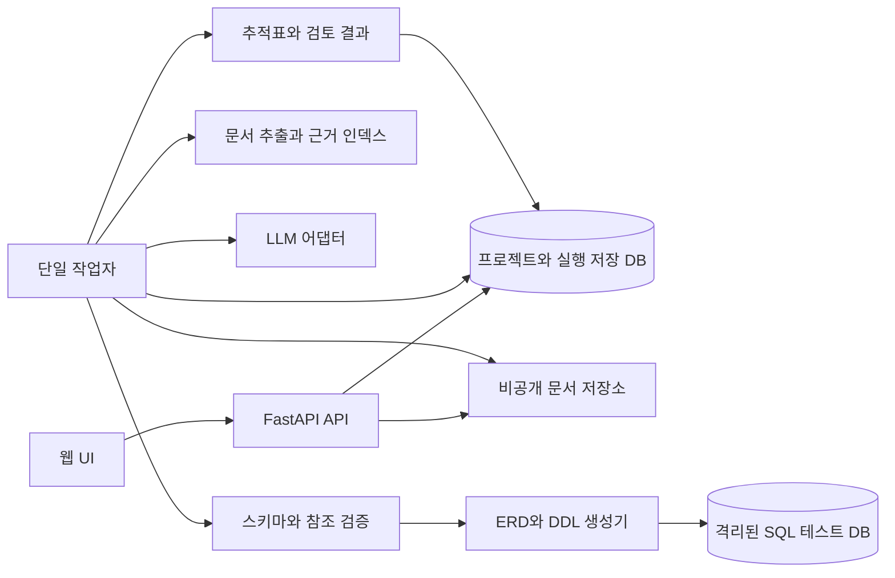

# TRD

> 본문은 전체 제품의 장기 목표다. 이번 백엔드의 범위·수용 기준과 실제 검증 상태는 [백엔드 MVP 실행 계획](tasks/001-백엔드-MVP.md)을 따른다.

## 1. 문서 목적과 구현 전제

| 항목 | 내용 |
| --- | --- |
| 프로젝트 | ITSM 요구사항 기반 시스템 자동 설계 에이전트 |
| 버전·최종 수정일 | 0.3 · 2026-10-07 |
| 상태 | 개발팀 검토용 기술 설계안 |
| 기준 | [PRD](PRD.md), [요구사항 정의서](요구사항_정의서.md), [기능 명세서](기능_명세서.md) |

목표 사양을 구현할 구성, 처리 계약, 저장 구조, API, 검증 방법을 정의한다. 특정 라이브러리의 최신 기능이나 실제 구현 완료를 주장하는 문서가 아니다. 의존성 버전과 모델명은 구현 착수 시 검증·고정한다.

### 1.1 개발 기준과 예정 구조

`itsm-design-agent` 저장소를 프로젝트 루트로 사용한다. 현재 저장소에는 FastAPI 백엔드 기반 코드가 있으며 ITSM 에이전트 기능은 목표 사양에 따라 구현한다. 이전 데모의 코드·라이브러리 구성·실행 방식·검증 실적을 전제로 하지 않는다. 현재 문서는 목표 설계이며 코드 구현 여부는 작업 계획과 실제 검증으로 관리한다.

| 경로 | 역할 | 생성 시점 |
| --- | --- | --- |
| `docs/plans/` | 기획·요구사항·기능·기술 기준 | 현재 관리 중 |
| `backend/` | 현재 API 기반 코드와 테스트, 향후 에이전트·저장·검증 모듈 | 존재, ITSM 기능 확장 예정 |
| `frontend/` | 문서 입력, 설계 조회, ERD·추적표 화면 | UI 구현 착수 |
| `docs/plans/tasks/` | 기능별 개발 계획·진행·검증 기록 | 복수 단계 작업 착수 |
| `docs/evaluation/` | 평가 절차와 실측 보고서 | 평가 자료 작성 |

기술 선택은 아래 제안안을 기준으로 팀 숙련도·요구사항·비용을 확인해 확정한다. 폴더를 미리 채우기 위한 샘플 코드나 불필요한 모듈은 만들지 않는다.

## 2. 아키텍처

API는 입력 검증과 작업 등록·조회에 집중한다. 장시간 생성은 단일 별도 작업자가 처리한다. Redis·분산 작업 큐를 새로 도입하지 않고 DB에 저장한 대기 작업을 처리한다. 작업자는 원자적 상태 갱신으로 하나의 작업을 선점한다. 여러 작업자로 확장하려면 별도 동시성 설계와 검증을 진행한다.

웹 UI는 API 상태를 2초마다 조회한다. 영속화한 실행 상태가 최종 기준이며 브라우저 연결 끊김이 작업을 중단시키지 않는다.

### 2.1 이번 백엔드 구현 스택

FastAPI/Pydantic을 유지하고 LangGraph의 단일 StateGraph로 generate → validate → render → review를 실행한다. Anthropic 공식 SDK `messages.create(output_config.format=...)`와 `transform_schema(Pydantic 모델)`을 사용하며, stop_reason 확인 후 Pydantic 검증을 수행한다. 잘린 JSON은 파싱 오류로 숨기지 않고 출력 한도 초과로 보고한다. Langfuse 공식 SDK로 내용 없는 단계·모델 사용량 추적을 선택적으로 제공한다. 실행·환경·실측 상태는 [실행 계획](tasks/001-백엔드-MVP.md)과 [README](../../README.md)를 따른다.

기본값은 claude-haiku-4-5, 출력 2048토큰, 캐싱 활성화다. 입력 12,000자, 호출당 120초이며 SDK 재시도는 0회다. `/api/v1/design`은 DB 없이 실행하고 기존 DB 초기화는 `INITIALIZE_DATABASE`로 선택한다. 자료형·단일 키 제약 범위와 추적표 단순화는 실행 계획에 명시한다. 아래 구성은 장기 목표이며 현재 백엔드에 저장·작업자·공급자 추상화를 추가하는 근거로 사용하지 않는다.

### 2.2 장기 기술 선택안

| 계층 | 선택안 | 이유·제약 |
| --- | --- | --- |
| UI | React 기반 웹 UI 제안 | 요구사항·ERD·추적표 화면 구성; 팀 검토 후 확정 |
| API·작업자 | Python·FastAPI, 명시적인 순차 실행 모듈 | 단계별 입출력·실패·재시도 처리 |
| 스키마 | Pydantic 계열의 명시적 모델 | LLM 결과와 API 입력 검증 |
| 저장 DB | PostgreSQL | 실행·스냅샷·검토 기록 저장; 로컬 SQLite 호환은 별도 선택 |
| 원문·파일 | 앱 외부의 비공개 로컬 디렉터리 | MVP 단일 호스트, 임의 경로 접근 금지 |
| ERD | 공통 모델을 Mermaid로 변환 | 화면 시각화와 원본 내보내기 |
| DDL | PostgreSQL 단일 방언 | 테스트 대상 제한 |
| LLM | 교체 가능한 단일 공급자 어댑터 | 모델·예산은 사전 비교 후 확정 |

LLM에는 SQL 실행 도구, 셸, 파일 시스템 임의 접근 권한을 제공하지 않는다. 외부 전송 대상은 가상 문서와 필요한 설계 문맥이며, 실데이터 도입은 별도 검토 대상으로 남긴다.

## 3. 입력 추출과 근거 모델

지원 제한은 기능 명세서 2.1을 단일 기준으로 사용한다. 업로드는 스트리밍 크기 제한을 적용하고 확장자·파일 시그니처를 확인한다. DOCX 압축 해제 크기를 제한하고 외부 링크의 내용을 가져오지 않는다. 추출기는 별도 제한 프로세스에서 동작시키고 시간 초과·비정상 종료를 오류로 처리한다.

각 입력은 원본 파일 해시와 추출 버전을 가진다. 추출 블록은 다음 정보를 저장한다.

| 필드 | 내용 |
| --- | --- |
| document_revision_id, block_id | 불변 문서와 블록 식별자 |
| locator | PDF 페이지, DOCX 문단/표/행/셀, TXT 행 범위 |
| raw_text, normalized_text | 원문 추출값과 정규화 값 |
| normalization_version | 공백·줄바꿈 변환 규칙 버전 |

근거 참조는 블록 ID, 정규화 문자열의 문자 시작·끝 위치, 인용문을 가진다. 서버가 해당 구간과 인용문의 일치를 검사한다. 여러 블록에 걸친 근거는 여러 참조로 저장한다. 표시 시 원문 블록도 함께 보여준다. 업로드 순서나 문서 이름만으로 근거를 식별하지 않는다.

## 4. 실행 상태와 작업 처리

정상 흐름은 다음과 같다.

`queued → running(analysis) → awaiting_input → queued → running(design/review) → 완료 상태`

완료 상태는 completed, completed_with_warnings, completed_with_errors 중 하나다. 기술 실행 실패는 failed, 질문 대기 중 문서 교체는 superseded다. 완료 상태 판단 우선순위는 기술 실행 실패 → 구조·DDL 오류 → 미해결 경고·DDL 미실행 → 정상 완료 순이다.

실행 등록은 문서 준비 상태와 프로젝트 활성 실행 제약을 하나의 트랜잭션에서 확인한다. 멱등 키는 프로젝트와 연산 범위에서 유일하게 저장하고 요청 해시를 함께 비교한다. 설계 계속 진행 요청도 멱등성을 보장하며 답변 동결과 상태 변경을 같은 트랜잭션으로 처리한다.

작업자는 10초마다 heartbeat를 갱신한다. 60초 이상 갱신이 없고 작업 소유자를 복구할 수 없는 실행은 WORKER_INTERRUPTED로 실패 처리한다. 단일 호출 제한 120초와 실행 활성 처리 15분을 별도로 관리한다. 질문 대기·큐 대기는 활성 시간에서 제외한다. 모든 값은 초기 설정이다.

단계별 재시도는 총 1회다. 형식 복구와 일시적 공급자 오류가 같은 한도를 공유한다. 잘못된 키·권한 오류, 입력 상한 초과는 자동 재시도하지 않는다. 완료하지 못한 실행을 자동으로 샘플 모드로 바꾸지 않는다. 재실행은 새 run_id를 만든다.

## 5. 단계 계약과 LLM 경계

| 단계 | 입력 | 출력 | 검증 |
| --- | --- | --- | --- |
| 분석 | 추출 블록 | 요구사항·질문 | 스키마, ID, 근거 인용 |
| 기능 설계 | 요구사항·답변 스냅샷 | 기능 명세 | 필수 필드, 요구사항 참조 |
| 데이터 설계 | 요구사항·기능 | 공통 데이터 모델·설계 근거 | ID·키·타입·관계 참조 |
| 변환 | 검증된 모델 | ERD·DDL·추적표 | 생성기 규칙, 표현 일치 |
| 의미 검토 | 원문·답변·설계·규칙 검사 | 누락·상충 후보 | 문제 근거와 관련 ID |
| 마감 | 모든 단계 결과 | 완료 상태·파일 목록 | 파일 해시·상태·허용 정책 |

출력 필드는 명시적인 JSON 스키마로 제한한다. 스키마에 맞는 출력이라도 실제 근거와 업무 의미는 별도 검증한다. 프롬프트에는 입력을 분석 대상 데이터로 구분하고, 근거 없는 정책은 proposal 또는 확인 필요로 출력하도록 규정한다. 문서가 명령 경계를 바꾸지 못하도록 도구 권한은 서버 코드에서 제한한다.

기능·데이터 단계의 형식 복구로 선행 결과가 바뀌면 그 이후 산출물은 모두 무효화하고 다시 생성한다. 최종 의미 검토는 업무 정책을 자동 수정하지 않는다. 원문을 재해석해야 하는 수정은 사용자 보완을 받은 새 실행으로 처리한다.

각 단계 전에 입력·예상 출력·프롬프트를 포함한 토큰 예산을 계산한다. 예산 초과는 명시적으로 중단한다. 모델명, 입력·출력 예산과 공급자 요청 시간은 필수 설정이며 실제 선택 모델에 맞춰 정한다. 모델 버전·프롬프트 버전이 바뀌면 평가를 다시 수행한다.

## 6. 공통 산출물 스키마

| 객체 | 필수 필드 |
| --- | --- |
| Requirement | id, text, kind, provenance, evidence[], needs_confirmation, priority, priority_reason |
| Question | id, requirement_ids[], type, question, evidence[], status |
| Answer | question_id, version, text 또는 unresolved, created_at |
| Function | id, name, actor, description, inputs[], outputs[], preconditions[], rules[], exceptions[], priority, requirement_ids[] |
| Table | id, name, description, columns[], primary_key[], uniques[], foreign_keys[], requirement_ids[], function_ids[] |
| Column | id, name, type, nullable, length/precision/scale, default_kind, description |
| ForeignKey | source_column_ids[], target_table_id, target_column_ids[], on_delete |
| Rule | id, description, requirement_ids[], enforcement(database/application/unresolved), representation |
| TraceLink | source_id, target_id, relation, reason, provenance |
| ReviewFinding | id, type, severity, related_ids[], evidence[], description, suggestion, detector |
| ArtifactManifest | kind, run_id, schema_version, model_hash, file_hash, validation_status |

자료형은 integer, bigint, numeric, varchar, text, boolean, date, timestamptz, uuid 범위에서 시작한다. varchar 길이와 numeric 정밀도·소수 자릿수는 검증한다. 기본값은 없음·허용 리터럴·허용 서버 함수로 구조화하며 자유 SQL 표현식을 받지 않는다. FK의 삭제 정책도 제한된 열거값으로 처리한다.

복합 PK·UNIQUE·FK는 컬럼 ID 배열로 표현하고 개수·순서·타입 호환성을 검사한다. CHECK는 초기 버전에서 자유 표현식으로 생성하지 않는다. 필요한 범위·조건 제약은 미구현 규칙으로 표시하고, 이후 구조화된 제약 표현을 추가할 수 있다. application 규칙을 DB만으로 충족한다고 평가하지 않는다.

## 7. 저장 설계

완료 산출물은 실행별 JSONB 스냅샷으로 저장한다. 고객 테이블·컬럼마다 서비스 DB의 개별 테이블을 만드는 방식은 사용하지 않는다. 관계형 테이블은 프로젝트·문서·실행·검토 등 운영에 필요한 범위로 제한한다.

| 테이블 | 주요 필드·관계 |
| --- | --- |
| projects | id, name, description, created_at |
| document_revisions | id, project_id, original_name, storage_key, sha256, extraction_version, status, blocks_json |
| runs | id, project_id, document_revision_id, parent_run_id, status, phase, config_snapshot, answer_snapshot, result_json, result_schema_version, heartbeat_at, timestamps |
| clarification_answers | id, run_id, question_id, version, text, unresolved, created_at |
| stage_attempts | id, run_id, stage, attempt_no, input_hash, output_json, error_code, duration, token_usage |
| artifacts | id, run_id, kind, storage_key, file_hash, model_hash, validation_status |
| review_decisions | id, run_id, finding_id, disposition, reason, created_at |
| request_keys | project_id, operation, key, request_hash, run_id |

기본 PK는 UUID로 하고 FK와 필요한 유일성 제약을 적용한다. stage_attempts는 실행·단계·시도 번호를 유일하게 둔다. 활성 실행 제약과 작업 선점은 DB 트랜잭션으로 보호한다. 결과 JSON의 참조 무결성은 애플리케이션 검증으로 보완한다.

파일은 임시 경로에 쓴 뒤 해시를 확인하고 최종 경로로 이동한다. DB에 산출물 목록과 완료 상태를 함께 커밋한다. 커밋되지 않은 파일은 다운로드 대상이 아니며 정리 작업이 제거한다. DB와 파일 저장소를 함께 백업해야 완전한 복구가 가능하다.

## 8. API 계약안

`/api/v1`를 기본 경로로 한다. 아래는 새로 구현할 목표 API 계약이다. 오류 본문은 `code`, `message`, `details`, `run_id`, `retryable`을 제공하고 내부 스택·비밀값은 제외한다.

| 메서드·경로 | 요청·응답 요약 |
| --- | --- |
| POST /projects | 이름·설명 → 201 프로젝트 |
| GET /projects | 페이지 단위 목록 |
| GET /projects/{id} | 프로젝트와 실행 요약 |
| POST /projects/{id}/documents | multipart 파일 → 202 리비전·추출 상태 |
| GET /documents/{id} | 추출 상태·본문·블록·오류 |
| POST /projects/{id}/runs | 리비전·parent_run_id 선택 + Idempotency-Key → 202 실행 |
| GET /runs/{id} | 상태·단계·경과 시간·질문·검증 요약 |
| PUT /runs/{id}/answers/{question_id} | 기대 버전·답변 또는 unresolved → 저장 버전 |
| POST /runs/{id}/continue | 답변 버전·미해결 진행 선택 + Idempotency-Key → 202 |
| POST /runs/{id}/supersede | awaiting_input 실행만 입력 교체용 종료 |
| GET /runs/{id}/result | 결과 스냅샷·검토 기록; 미준비 시 409 |
| POST /runs/{id}/review-decisions | finding_id·처분·사유 → 201 기록 |
| GET /runs/{id}/artifacts/{kind} | 검증 정책 확인 후 파일 스트림 |

일반 오류는 400, 없는 리소스 404, 활성 실행·버전 충돌 409, 크기 초과 413, 미지원 형식 415, 입력 검증 422로 구분한다. 모든 하위 리소스는 프로젝트·실행 관계를 검증한다. 파일 경로를 URL 파라미터로 직접 받지 않는다. 로컬 인증 없는 프로파일은 외부 인터페이스로 바인딩하지 않는다.

## 9. ERD와 SQL 검증

공통 모델의 정렬·정규화된 표현에서 model_hash를 계산하고 ERD·DDL·검증 결과에 기록한다. 서로 다른 해시의 파일을 같은 실행 결과로 묶지 않는다. SQL 식별자는 소문자 영문·숫자·밑줄로 제한하고 길이·중복을 검사한다. 한글 설명은 라벨로만 사용하고 SQL·Mermaid 문법에 맞춰 이스케이프한다.

DDL 생성기는 허용된 CREATE TABLE과 FK 추가용 ALTER TABLE만 출력한다. 순환 FK는 모든 테이블 생성 후 적용한다. 서버가 생성한 DDL도 파싱하여 허용 구문을 재검사한다. DROP, DML, COPY, 확장 설치, 함수 정의, 임의 외부 접근은 허용하지 않는다.

검증 DB는 서비스 저장 DB와 분리된 폐기 가능한 PostgreSQL 환경이다. 제한된 검증 역할, 실행별 임시 스키마, 쿼리·락 시간 제한을 사용하고 인터넷·외부 서비스 접근을 막는다. 정리 권한은 검증 SQL 역할과 분리된 서버 정리 작업만 갖는다. 검증기는 테이블 생성 후 카탈로그에서 컬럼·PK·UNIQUE·FK·NULL 정보를 읽어 모델과 비교한다.

결과는 passed, failed, not_run으로 저장한다. 검증 환경 장애는 not_run이며 초안 경고를 남긴다. SQL 자체의 문법·제약 오류는 failed이다. 실패·미실행을 성공으로 대체하지 않는다. SQL 성공은 업무 정책의 정확성이나 성능·보안 설계 완성을 보장하지 않는다.

## 10. 보안과 운영

LLM 키는 서버 환경변수 또는 배포 비밀 저장소에만 둔다. 원문·추출문·원시 모델 응답을 일반 로그에 남기지 않는다. 로그는 run_id, stage, duration, token_usage, retry_count, error_code, 버전 중심으로 남긴다. 오류 메시지와 내보내기에서 키·연결 문자열을 마스킹한다.

파일명은 화면 표시용으로만 사용하고 저장 경로는 서버 UUID로 결정한다. Markdown/HTML은 실행 가능한 태그를 차단하며 CSV는 수식 실행 시작 문자열을 이스케이프한다. Mermaid는 안전한 렌더링 설정과 서버 라벨 이스케이프를 적용한다.

필수 운영 설정은 저장 DB 주소, 비공개 파일 경로, 모델 제공자·모델 ID·키, 토큰 예산, 입력 제한, 실행 시간 제한, 테스트 DB 주소다. 원격 검증 DB 주소를 사용자가 입력하도록 제공하지 않는다. 공급자별 보관·전송 설정은 실제 계정 정책을 확인한 후 기록한다.

로컬 시연은 API·작업자·저장 DB·검증 환경으로 구성한다. 재기동 때 활성 작업을 확인하고 중단 실행을 실패로 정리한다. 배포 전 DB 마이그레이션을 수행하고 실패 시 서버가 정상 상태라고 보고하지 않는다. 보관 기간·수동 정리 절차는 데모 운영 전에 README에 확정한다.

## 11. 테스트와 평가

### 11.1 구현 검증

| 계층 | 의미 있는 검사 |
| --- | --- |
| 입력 | 파일 형식·상한·빈 문서·암호화 PDF·DOCX 확장 크기·위치 매핑 |
| 스키마 | 인용문 위조·ID 중복·없는 참조·복합 FK 불일치 |
| 실행 | 중복 클릭·멱등 키 충돌·답변 버전 충돌·작업자 중단·재시도 상한 |
| 산출물 | 동일 모델 해시·SQL 실행·ERD 구조·다운로드 차단 |
| 저장 | 새로고침 조회·이전 결과 불변·파일 저장/DB 커밋 실패 |
| 보안 | 문서 내 명령·경로 순회·HTML·CSV 수식·키 노출 방지 |
| 전체 흐름 | 두 업무 정상 시나리오·질문 미해결·모델 실패·DDL 실패 |

샘플 모드 테스트와 실제 LLM 평가를 분리한다. 샘플 모드 통과를 실제 모델 품질로 보고하지 않는다. 실제 호출 비용은 개발 단계에서 사용 한도 내에서 측정한다.

### 11.2 평가 세트와 계산

기획서의 D01~D08을 사용한다. 개발용은 D01 기본 요청, D04 예외 장애, D05 정보 부족 요청, D08 상충 장애로 정한다. 최종 평가는 D02 기본 장애, D03 예외 요청, D06 정보 부족 장애, D07 상충 요청으로 구성한다. 최종 4건을 같은 설정으로 각 3회 실행하여 12개 실행을 평가한다.

| 지표 | 계산 |
| --- | --- |
| 추출 정밀도 | 정답으로 인정한 추출 요구사항 / 전체 추출 요구사항 |
| 추출 재현율 | 추출된 기준 요구사항 / 전체 기준 요구사항 |
| 기능 반영률 | 반영된 기준 필수 기능 / 전체 기준 필수 기능 |
| 데이터 규칙 충족률 | 표현 가능한 기준 데이터 규칙 / 전체 기준 데이터 규칙 |
| 추적 정확도 | 타당한 생성 연결 / 전체 생성 연결 |
| 추적 충족률 | 필요한 연결을 모두 갖춘 요구사항 / 연결 대상 요구사항 |
| 문제 탐지 정밀도 | 타당한 지적 / 전체 문제 지적 |
| 문제 탐지 재현율 | 발견한 기준 문제 / 전체 기준 문제 |
| DDL 성공률 | 생성·검증에 성공한 실행 / 전체 평가 실행 |

요구사항 분할 차이는 기준 답안의 의미 단위에 매핑하여 과다 분할로 점수가 높아지지 않게 한다. 동등한 설계 명칭을 인정하고 application 규칙과 데이터 제약을 구분한다. 사람이 정상으로 판단한 입력에 대한 오탐도 기록한다.

분모가 없으면 N/A로 표시한다. 기대 출력이 있는데 모델이 아무것도 생성하지 못한 실패는 요구사항 재현율·기능·규칙 반영에서 0으로 반영하고, 출력 정밀도는 N/A와 실패 건수를 함께 기록한다. 전체 실행을 분모로 하는 DDL 성공률에서는 실패·미실행을 모두 비성공으로 센다. 성공 실행만 골라 품질을 보고하지 않는다.

두 검토자가 사전 기준에 따라 독립 검토 후 이견을 합의한다. 모델·프롬프트·스키마·생성기 버전을 고정하고 최초 결과와 자동 수정 후 결과를 구분하여 기록한다. 의도적으로 모델에서 이력 구조 등을 제거한 결함 주입 평가는 원문 분석 평가와 별도 집계한다. 최종 세트로 튜닝한 이후의 결과는 최초 최종 평가와 구분한다.

## 12. 구현 순서와 결정 항목

1. 문서 입력·위치·스키마와 평가 기준을 먼저 확정한다.
2. 현재 backend의 계층·테스트 설정을 확인하고 UI 환경과 ITSM 평가 입력을 준비한다.
3. 프로젝트·실행 저장과 질문 확인 지점을 구현한다.
4. 공통 모델·변환기·추적표·검토 흐름을 연결한다.
5. 격리 DB 검증과 오류별 다운로드 정책을 통합한다.
6. 전체 흐름 테스트 후 설정을 고정하고 최종 평가를 수행한다.

모델명·의존성 버전, 실제 토큰·비용 상한, 배포 호스트와 보관 기간은 구현 전에 확정해야 한다. UI 프레임워크 전환·RAG 확대·다중 작업자 운영은 MVP 검증을 마친 후 필요성을 판단한다.
